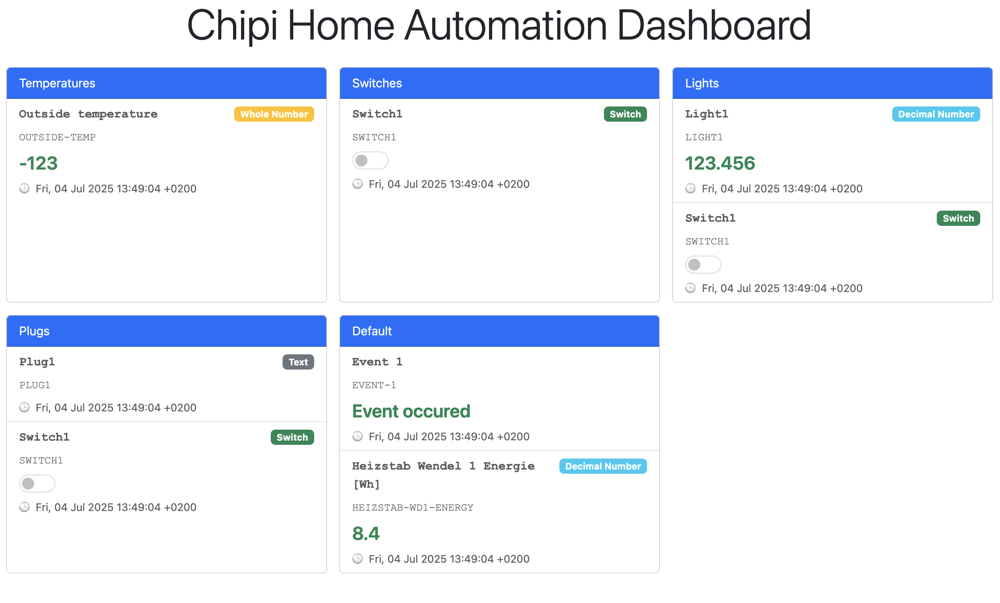

# Chipi-API

Chipi-API adds an optional REST/JSON layer on top of the **Chipi** home-automation
framework. It lets you read and update item values via HTTP; every request is
authorised with scope-based API keys.

> Licence: Apache 2.0 (see root‐level `LICENSE`).

---

## Prerequisites

* SBCL ≥ 2.x (or any other supported Common Lisp implementation)  
* Quicklisp (or OCICL)  
* ASDF systems `chipi` **and** `chipi-api`

```lisp
;; Quicklisp
(ql:quickload :chipi-api)
;; OCICL
(asdf:load-system :chipi-api)
```

---

## Quick start (REPL)

```lisp
(hab:defconfig "chipi"
  ;; 1 – initialises runtime, actor system, timers …
  ;; 2 – Chipi-API specific environment
  (api-env:init
    :apikey-store (apikey-store:make-simple-file-backend) ; or *memory-backend* for testing
    :apikey-lifetime (ltd:duration :day 100))

  ;; 3 – HTTP server on port 8765
  (api:start))
```

For a complete, runnable example have a look at
[example-web.lisp](./example-web.lisp) in the project root.

### Example items

```lisp
(defitem 'lamp  "Living-room lamp" 'boolean :initial-value 'item:false)
(defitem 'temp  "Temperature"      'float   :initial-value 21.5)
```

### Read-only items

Items can be marked as read-only for external systems by setting the `:ext-readonly` tag:

```lisp
(defitem 'sensor "Temperature sensor" 'float 
  :initial-value 20.0
  :tags '((:ext-readonly . t)))
```

Read-only items can still be read via the REST API but cannot be updated through external calls. The tag value should be the Lisp boolean `t`.

**Note:** This is a convention that should be respected by the UI and external systems. The server does not enforce read-only restrictions - it's up to client implementations to check for the `:ext-readonly` tag and prevent updates accordingly.

---

## Creating an API key

```lisp
(defparameter *my-key*
  (apikey-store:create-apikey :access-rights '(:read :update)))
```

### API key persistence

```lisp
(api-env:init
  :apikey-store (apikey-store:make-simple-file-backend))
```

The file backend stores keys in `runtime/apikeys`.

---

## REST interface

A full OpenAPI 3.0 specification lives in `chipi-api.yaml`.

Besides individual items the API also exposes *itemgroups*, logical
containers that hold multiple items.

| Endpoint            | Method | Required scope |
|---------------------|--------|----------------|
| `/items`            | GET    | `read`         |
| `/items/{itemName}` | GET    | `read`         |
| `/items/{itemName}` | POST   | `update`       |
| `/itemgroups`            | GET    | `read`         |
| `/itemgroups/{groupName}` | GET    | `read`         |
| `/events/items`     | GET    | `read`         |

Add header `X-Api-Key: <your-key>` to every call.

### Examples (curl)

```bash
# List all items
curl -H "X-Api-Key: $MY_KEY" http://localhost:8765/items

# List all itemgroups
curl -H "X-Api-Key: $MY_KEY" http://localhost:8765/itemgroups

# Get single item
curl -H "X-Api-Key: $MY_KEY" http://localhost:8765/items/lamp

# Get single itemgroup
curl -H "X-Api-Key: $MY_KEY" http://localhost:8765/itemgroups/living

# Update item
curl -X POST -H "X-Api-Key: $MY_KEY" -H "Content-Type: application/json" \
     -d '{"value": true}' http://localhost:8765/items/lamp
```

### Server-Sent Events (SSE)

The API provides real-time item updates via Server-Sent Events:

```bash
# Connect to item events stream
curl -H "Accept: text/event-stream" \
     "http://localhost:8765/events/items?apikey=$MY_KEY"
```

The SSE endpoint sends:
- Connection confirmation messages
- Real-time item change notifications with full item data
- Periodic heartbeat messages to keep the connection alive

Event format follows the SSE standard with `data:` fields containing JSON payloads.

#### Event Types

**Connection Event:**
```
{"event":{"type":"connection","message":"Connected to item events"}}
```

**Item Change Event:**
```
{"event":{"type":"item-change","item":{"name":"lamp","label":"Living-room lamp","type-hint":"boolean","tags":{},"item-state":{"value":true,"timestamp":1703123456}}}}
```

**Heartbeat Event:**
```
{"event":{"type":"heartbeat","timestamp":1703123456}}
```

#### Item Change Payload Structure

| Field | Type | Description |
|-------|------|-------------|
| `event.type` | string | Always `"item-change"` |
| `event.item.name` | string | Item identifier |
| `event.item.label` | string | Human-readable item name |
| `event.item.type-hint` | string | Data type (`boolean`, `float`, `integer`, `string`) |
| `event.item.tags` | object | Item metadata (including `:ext-readonly` flag) |
| `event.item.item-state.value` | any | Current item value |
| `event.item.item-state.timestamp` | number | Common Lisp universal-time timestamp (seconds since 1900-01-01) |

#### Timestamp Format

Timestamps are provided as Common Lisp universal-time values (seconds since January 1st, 1900, 00:00:00 GMT). To convert to Unix timestamp (seconds since 1970-01-01), subtract 2208988800:

```javascript
// Convert CL universal-time to Unix timestamp
const unixTimestamp = universalTime - 2208988800;
const date = new Date(unixTimestamp * 1000);
```

```bash
# Convert in shell (example with timestamp 3913123456)
echo $((3913123456 - 2208988800))  # Result: 1704134656 (Unix timestamp)
```

---

## Scope model

| Scope  | Meaning            |
|--------|--------------------|
| `read` | read-only          |
| `update` | push new values  |
| `delete` | reserved         |
| `admin` | full access       |

The highest requested scope must not exceed the highest scope granted to the
API key.

---

## Shutting down

```lisp
(api:stop)     ; stop only the web API
(hab:shutdown) ; stop the entire Chipi instance
```


# Chipi UI

Chipi UI is a responsive web UI, based on CLOG and Bootstrap 5, with realtime
updates of values. It offers two modes that can be combined:

* an **auto-generated overview** at `/` that renders all itemgroups and items,
  driven by UI tags (see below) — zero configuration;
* **pages** declared with `defpage`: explicitly composed views built from
  widgets (toggles, inputs, sliders, charts, …), each served at its own URL —
  a wall-panel tablet bookmarks `/wall`, a phone `/mobile`, and so on.

Example of setup:

```lisp
(hab:defconfig "chipi"
  ;; neither api-env:init nor api:start are required for the UI
  (ui:start :host "localhost" :port 8080))
```

For a complete, runnable example (items, pages, a chart with demo data) see
[example-web.lisp](./example-web.lisp).

## Pages

Pages are defined with the `defpage` macro from package `chipi-ui.page`
(nickname `page`), typically via `(:use :cl :hab :page)` in the config
package:

```lisp
(defpage 'wall-panel "Wall panel"
  :path "/wall"                    ; optional; defaults to "/<id>" downcased
  :title "Ground floor"            ; optional page heading + browser tab title
  (section "Lights"
    (toggle 'switch1)
    (value 'motion-sensor :label "Motion"))
  (section "Climate"
    (value 'outside-temp :format "~,1f °C")
    (setpoint 'target-temp :min 15.0 :max 25.0 :step 0.5)
    (chart 'outside-temp :range '(:hours 6)))
  (page-link 'cellar))

(defpage 'cellar "Cellar"
  ;; embeds an existing itemgroup, rendered like on the overview
  (itemgroup-ref 'plugs))
```

Semantics:

* The page `label` is the short name used by `page-link`s pointing at the
  page; `:title`, when given, renders as the page heading and becomes the
  browser tab title. Without `:title` no heading is rendered (useful for
  space-constrained panels).
* Every page is directly reachable (deep-linkable) at its `:path`. A page
  with `:path "/"` replaces the auto-generated overview; without one the
  overview stays on `/`.
* `page-link` navigation pushes browser history: back/forward work, a back
  button is rendered on navigated pages, and a reload stays on the current
  page.
* Re-defining a page (same id) replaces it, like the other `def*` macros.
* Widgets are ordinary values, so pages can be composed programmatically:

```lisp
(apply #'section "All temperatures"
       (mapcar (lambda (id) (value id :format "~,1f °C"))
               '(cellar-temp boiler-temp freezer-temp)))
```

### Widgets

| Widget | Item type | Description |
|--------|-----------|-------------|
| `(value item &key label format)` | any | Read-only display; `format` is a CL format string (e.g. `"~,1f °C"`); booleans render as ON/OFF |
| `(toggle item &key label)` | boolean | Switch control |
| `(text-input item &key label)` | string | Text field |
| `(number-input item &key label min max step)` | integer/float | Number entry field |
| `(slider item &key label min max step)` | integer/float | Slider with a live value label (defaults 0–100, step 1) |
| `(setpoint item &key label min max step)` | integer/float | Stepper with −/+ buttons, e.g. for target temperatures |
| `(selection item &key label choices)` | string | Dropdown; `choices` is an alist of `(value . label)` |
| `(chart item &key label type range persistence)` | number/boolean | History chart (see below) |
| `(section label &rest widgets)` | — | Titled card grouping widgets |
| `(page-link page-id &key label)` | — | Navigation link to another page |
| `(itemgroup-ref group-id)` | — | Embeds an itemgroup as an overview-style card |

The widget `label` always defaults to the item's own label. Unknown item or
page references render an inline "Unknown …" placeholder instead of breaking
the page.

### Charts

`chart` plots an item's history from a **historic persistence** (e.g.
influx) and appends new values in realtime as the item changes.

* `:range` — either a plist passed to `persp:make-relative-range`, e.g.
  `'(:hours 6)` or `'(:days 1)` (default: last day), or a ready
  `persp:range` object.
* `:type` — `:line` (default) or `:bar`.
* `:persistence` — the persistence id to load from; without it the first
  defined historic persistence is used.
* Items without a historic persistence render a "No history available"
  placeholder. `example-web.lisp` contains a small in-memory historic
  persistence that seeds demo data for the chart.
* Charts are rendered with [uPlot](https://github.com/leeoniya/uPlot); uPlot
  and Bootstrap are loaded from a CDN, so the *browser* needs internet
  access (the server does not).

## UI Tags

Items and itemgroups support special tags that control how they are rendered in the UI.

### Item tags

| Tag | Value | Description |
|-----|-------|-------------|
| `:ui-type` | string | Overrides the default type badge label (e.g. "Light" instead of "Switch") |
| `:ui-readonly` | `t` | Boolean items render as plain "ON"/"OFF" text instead of an interactive toggle |

```lisp
;; Custom type label
(defitem 'switch1 "Switch1" 'boolean :initial-value 'item:false
  :tags '((:ui-type . "Light")))

;; Read-only boolean displayed as ON/OFF text
(defitem 'motion-sensor "Motion Sensor" 'boolean :initial-value 'item:true
  :tags '((:ui-readonly . t)))
```

### Itemgroup tags

| Tag | Value | Description |
|-----|-------|-------------|
| `:ui-link` | — | Renders the itemgroup as a clickable navigation link instead of an inline card |

```lisp
;; Renders as a navigation link that opens a detail page
(defitemgroup 'lights "Lights" :tags '((:ui-link)))
```

These tags drive the auto-generated overview and `itemgroup-ref` widgets;
explicit pages choose their widgets directly.

## Screenshot



The UI is under active development.
