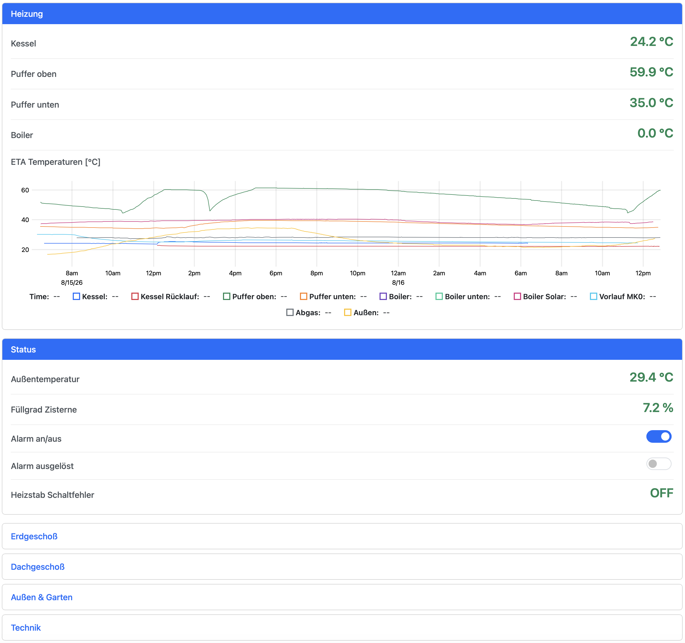

# Chipi-API

Chipi-API adds an optional REST/JSON layer on top of the **Chipi** home-automation
framework. It lets you read and update item values via HTTP; every request is
authorised with scope-based API keys.

> Licence: Apache 2.0 (see root‐level `LICENSE`).

---

## Prerequisites

* SBCL ≥ 2.x (or any other supported Common Lisp implementation)  
* Quicklisp (or OCICL)  
* ASDF systems `chipi` **and** `chipi-api`

```lisp
;; Quicklisp
(ql:quickload :chipi-api)
;; OCICL
(asdf:load-system :chipi-api)
```

---

## Quick start (REPL)

```lisp
(hab:defconfig "chipi"
  ;; 1 – initialises runtime, actor system, timers …
  ;; 2 – Chipi-API specific environment
  (api-env:init
    :apikey-store (apikey-store:make-simple-file-backend) ; or *memory-backend* for testing
    :apikey-lifetime (ltd:duration :day 100))

  ;; 3 – HTTP server on port 8765
  (api:start))
```

For a complete, runnable example have a look at
[example-web.lisp](./example-web.lisp) in the project root.

### Example items

```lisp
(defitem 'lamp  "Living-room lamp" 'boolean :initial-value 'item:false)
(defitem 'temp  "Temperature"      'float   :initial-value 21.5)
```

### Read-only items

Items can be marked as read-only for external systems by setting the `:ext-readonly` tag:

```lisp
(defitem 'sensor "Temperature sensor" 'float 
  :initial-value 20.0
  :tags '((:ext-readonly . t)))
```

Read-only items can still be read via the REST API but cannot be updated through external calls. The tag value should be the Lisp boolean `t`.

**Note:** This is a convention that should be respected by the UI and external systems. The server does not enforce read-only restrictions - it's up to client implementations to check for the `:ext-readonly` tag and prevent updates accordingly.

---

## Creating an API key

```lisp
(defparameter *my-key*
  (apikey-store:create-apikey :access-rights '(:read :update)))
```

### API key persistence

```lisp
(api-env:init
  :apikey-store (apikey-store:make-simple-file-backend))
```

The file backend stores keys in `runtime/apikeys`.

---

## REST interface

A full OpenAPI 3.0 specification lives in `chipi-api.yaml`.

Besides individual items the API also exposes *itemgroups*, logical
containers that hold multiple items.

| Endpoint            | Method | Required scope |
|---------------------|--------|----------------|
| `/items`            | GET    | `read`         |
| `/items/{itemName}` | GET    | `read`         |
| `/items/{itemName}` | POST   | `update`       |
| `/itemgroups`            | GET    | `read`         |
| `/itemgroups/{groupName}` | GET    | `read`         |
| `/events/items`     | GET    | `read`         |

Add header `X-Api-Key: <your-key>` to every call.

### Examples (curl)

```bash
# List all items
curl -H "X-Api-Key: $MY_KEY" http://localhost:8765/items

# List all itemgroups
curl -H "X-Api-Key: $MY_KEY" http://localhost:8765/itemgroups

# Get single item
curl -H "X-Api-Key: $MY_KEY" http://localhost:8765/items/lamp

# Get single itemgroup
curl -H "X-Api-Key: $MY_KEY" http://localhost:8765/itemgroups/living

# Update item
curl -X POST -H "X-Api-Key: $MY_KEY" -H "Content-Type: application/json" \
     -d '{"value": true}' http://localhost:8765/items/lamp
```

### Server-Sent Events (SSE)

The API provides real-time item updates via Server-Sent Events:

```bash
# Connect to item events stream
curl -H "Accept: text/event-stream" \
     "http://localhost:8765/events/items?apikey=$MY_KEY"
```

The SSE endpoint sends:
- Connection confirmation messages
- Real-time item change notifications with full item data
- Periodic heartbeat messages to keep the connection alive

Event format follows the SSE standard with `data:` fields containing JSON payloads.

#### Event Types

**Connection Event:**
```
{"event":{"type":"connection","message":"Connected to item events"}}
```

**Item Change Event:**
```
{"event":{"type":"item-change","item":{"name":"lamp","label":"Living-room lamp","type-hint":"boolean","tags":{},"item-state":{"value":true,"timestamp":1703123456}}}}
```

**Heartbeat Event:**
```
{"event":{"type":"heartbeat","timestamp":1703123456}}
```

#### Item Change Payload Structure

| Field | Type | Description |
|-------|------|-------------|
| `event.type` | string | Always `"item-change"` |
| `event.item.name` | string | Item identifier |
| `event.item.label` | string | Human-readable item name |
| `event.item.type-hint` | string | Data type (`boolean`, `float`, `integer`, `string`) |
| `event.item.tags` | object | Item metadata (including `:ext-readonly` flag) |
| `event.item.item-state.value` | any | Current item value |
| `event.item.item-state.timestamp` | number | Common Lisp universal-time timestamp (seconds since 1900-01-01) |

#### Timestamp Format

Timestamps are provided as Common Lisp universal-time values (seconds since January 1st, 1900, 00:00:00 GMT). To convert to Unix timestamp (seconds since 1970-01-01), subtract 2208988800:

```javascript
// Convert CL universal-time to Unix timestamp
const unixTimestamp = universalTime - 2208988800;
const date = new Date(unixTimestamp * 1000);
```

```bash
# Convert in shell (example with timestamp 3913123456)
echo $((3913123456 - 2208988800))  # Result: 1704134656 (Unix timestamp)
```

---

## Scope model

| Scope  | Meaning            |
|--------|--------------------|
| `read` | read-only          |
| `update` | push new values  |
| `delete` | reserved         |
| `admin` | full access       |

The highest requested scope must not exceed the highest scope granted to the
API key.

---

## Shutting down

```lisp
(api:stop)     ; stop only the web API
(hab:shutdown) ; stop the entire Chipi instance
```


# Chipi UI

Chipi UI is a responsive web UI, based on CLOG and Bootstrap 5, with realtime
updates of values. It offers two modes that can be combined:

* an **auto-generated overview** at `/` that renders all itemgroups and items,
  driven by UI tags (see below) — zero configuration;
* **pages** declared with `defpage`: explicitly composed views built from
  widgets (toggles, inputs, sliders, charts, …), each served at its own URL —
  a wall-panel tablet bookmarks `/wall`, a phone `/mobile`, and so on.

Example of setup:

```lisp
(hab:defconfig "chipi"
  ;; neither api-env:init nor api:start are required for the UI
  (ui:start :host "localhost" :port 8080))
```

For a complete, runnable example (items, pages, a chart with demo data) see
[example-web.lisp](./example-web.lisp).

## Pages

Pages are defined with the `defpage` macro from package `chipi-ui.page`
(nickname `page`), typically via `(:use :cl :hab :page)` in the config
package:

```lisp
(defpage 'wall-panel "Wall panel"
  :path "/wall"                    ; optional; defaults to "/<id>" downcased
  :title "Ground floor"            ; optional page heading + browser tab title
  (section "Lights"
    (toggle 'switch1)
    (value 'motion-sensor :label "Motion"))
  (section "Climate"
    (value 'outside-temp :format "~,1f °C")
    (setpoint 'target-temp :min 15.0 :max 25.0 :step 0.5)
    (chart 'outside-temp :range '(:hours 6)))
  (page-link 'cellar))

(defpage 'cellar "Cellar"
  ;; embeds an existing itemgroup, rendered like on the overview
  (itemgroup-ref 'plugs))
```

Semantics:

* The page `label` is the short name used by `page-link`s pointing at the
  page; `:title`, when given, renders as the page heading and becomes the
  browser tab title. Without `:title` no heading is rendered (useful for
  space-constrained panels).
* Every page is directly reachable (deep-linkable) at its `:path`. A page
  with `:path "/"` replaces the auto-generated overview; without one the
  overview stays on `/`. Either is only the *default* for `/` — each device
  can pick its own home page, see [Settings](#settings).
* `page-link` navigation pushes browser history: back/forward work, a back
  button appears in the app header on navigated pages, and a reload stays on
  the current page.
* Every view carries an app header: back (once navigated), the app name, a
  home button and the settings gear. Installed as a web app there is no
  browser chrome, so this is the navigation the user gets. On a locked
  device (see [Settings](#settings)) the gear is left out.
* Re-defining a page (same id) replaces it, like the other `def*` macros.
* Widgets are ordinary values, so pages can be composed programmatically:

```lisp
(apply #'section "All temperatures"
       (mapcar (lambda (id) (value id :format "~,1f °C"))
               '(cellar-temp boiler-temp freezer-temp)))
```

### Widgets

| Widget | Item type | Description |
|--------|-----------|-------------|
| `(value item &key label format)` | any | Read-only display; `format` is a CL format string (e.g. `"~,1f °C"`); booleans render as ON/OFF |
| `(toggle item &key label)` | boolean | Switch control |
| `(text-input item &key label)` | string | Text field |
| `(number-input item &key label min max step)` | integer/float | Number entry field |
| `(slider item &key label min max step)` | integer/float | Slider with a live value label (defaults 0–100, step 1) |
| `(setpoint item &key label min max step)` | integer/float | Stepper with −/+ buttons, e.g. for target temperatures |
| `(selection item &key label choices)` | string | Dropdown; `choices` is an alist of `(value . label)` |
| `(chart item-or-items &key label type range persistence transform fill line-width height refresh right-axis)` | number/boolean | History chart, one series per item (see below) |
| `(button caption action &key label)` | — | Push-button running `action` (see below) |
| `(button-group label &rest buttons)` | — | Several buttons sharing one row and label |
| `(section label &rest widgets)` | — | Titled card grouping widgets |
| `(row &rest widgets)` | — | Lays its widgets side by side in equal columns (see below) |
| `(page-link page-id &key label)` | — | Navigation link to another page |
| `(itemgroup-ref group-id)` | — | Embeds an itemgroup as an overview-style card |

The widget `label` always defaults to the item's own label. Unknown item or
page references render an inline "Unknown …" placeholder instead of breaking
the page.

### Horizontal rows

Widgets normally stack, one per line. `row` puts several next to each other in
equally wide columns — one column per child, so two children render 50/50 and
three 33/33/33:

```lisp
(section "Status"
  (row
    (chart 'outside-temp :label "Außentemperatur [°C]" :range '(:hours 12))
    (chart 'cistern-level :label "Füllgrad Zisterne [%]" :range '(:days 7))))
```

* `:columns` sets the count explicitly and wraps the children over several
  lines when they outnumber it, e.g. `(row :columns 2 …)` with four charts
  renders a 2×2 block.
* Below 768px the row collapses to a single column, so a phone still gets one
  widget per line.
* Any widget works, not just charts.

A row does **not** have to be inside a section — it is an ordinary widget and
goes anywhere one can, including directly under `defpage`. A page-level row of
sections puts two cards next to each other, which is otherwise impossible:
every section is full width on its own.

```lisp
(defpage 'technik "Technik"
  :title "Technik"
  (row (section "Kessel" (value 'boiler-temp))
       (section "Puffer" (value 'buffer-temp)))
  (page-link 'cellar))
```

One caveat when going section-less: the white card comes from `section`, not
from `row`. Bare item widgets in a page-level row sit directly on the page
background with no card around them — put a `section` in the row (as above),
or the row in a `section`, unless that is what you want.

Charts are the main beneficiary: a single-series chart over a short range is
mostly empty space at full width. A chart with many series is the opposite
case and stays easier to read wide — halving its width also halves the room
its time axis has.

### Action buttons

`button` is the one widget that is not bound to an item: clicking it calls a
function. That is what **momentary commands** need — a door opener, a
shutter's Auf/Stopp/Ab — because `item:set-value` is a no-op when the value
does not change, so an item-bound control cannot send the same command twice
in a row.

```lisp
(section "Jalousie Wohnzimmer"
  (button-group "Auf/Stopp/Ab"
    (button "▲" 'jal-wz-up)
    (button "■" 'jal-wz-stop)
    (button "▼" 'jal-wz-down))
  (slider 'jal-wz-pos :label "Position [%]"))

;; a single button; :label renders to the left, like an item widget's label
(button "Öffnen" 'tueroeffner-trigger :label "Türöffner")
```

* The action takes no arguments and its return value is ignored. An error it
  signals is logged (`Button action failed …`) and does not reach the browser
  connection, so a failing command cannot break the page.
* A **symbol** naming a function is resolved on every click, so redefining
  that function — from the REPL, over Slynk, against a running instance —
  takes effect without re-evaluating the page. `#'the-function` captures the
  function as of page definition instead.
* CLOG dispatches every browser event on its own thread, so an action that
  blocks (a bus write waiting for its ack) does not stall the UI.
* The action runs whenever anyone reaching the UI clicks the button; the UI
  has no per-widget authorization, so treat a button exactly like the
  toggles next to it.

### Charts

`chart` plots one or more items' history from a **historic persistence**
(e.g. influx) and appends new values in realtime as the items change.

* Passing a list of items renders one series per item in a shared,
  timestamp-aligned plot with a legend.  List elements are item ids or
  `(item-id . "Series label")` conses; series labels default to the item
  labels:

```lisp
(chart '((kessel-temp . "Kessel")
         (puffer-temp . "Puffer")
         boiler-temp)
       :label "Heizung" :range '(:hours 12))
```

* `:range` — either a plist passed to `persp:make-relative-range`, e.g.
  `'(:hours 6)` or `'(:days 1)` (default: last day), or a ready
  `persp:range` object.
* `:type` — `:line` (default) or `:bar`.
* `:persistence` — the persistence id to load from; without it the first
  defined historic persistence is used.
* `:transform` — a one-argument function applied to every charted value,
  historic and live alike, e.g. to chart a raw sensor reading in a display
  unit: `(chart 'level-sensor :transform (lambda (ma) (- (* 18.87 ma) 147.19)))`.
  It is called with a number (booleans chart as 1/0) and must return a
  number; a failing transform charts the point as a gap.
* `:fill` — the translucent area between each line and zero, in the series'
  own colour. `:auto` (default) fills a lone series and leaves a multi-series
  chart as bare lines; `t` fills every series (the fills overlap, fine for a
  few power flows around zero, mud for nine temperatures); `nil` never fills.
* `:line-width` — stroke width of every series in CSS pixels (default 2).
* `:right-axis` — plots some of the series against a second y-axis at the
  right edge, with a scale of its own, for a series whose unit differs from
  the rest — a battery's state of charge in % among power flows in W would
  otherwise be a flat line at the bottom of a scale in thousands:

  ```lisp
  (chart '((pv-power . "PV")
           (grid-power . "Netz")
           (battery-soc . "Batterie [%]"))
         :label "Energie [W]"
         :right-axis '(:series (battery-soc) :range (0 100)))
  ```

  `:series` lists the item ids that read against the right axis; `:range`
  fixes its bounds as `(min max)` (without it the axis auto-scales, which for
  a percentage lets 60..80 fill the plot height). Right-axis series are drawn
  dashed and never filled, so they can be told from the left-axis ones without
  the legend; a lone right-axis series lends the axis its colour. A series id
  not in the chart, or a range with `min >= max`, is an error at page
  definition.
* `:height` — plot height in CSS pixels (default 220); the width follows the
  container.
* `:refresh` — minimum seconds between two live-appended points of one
  series, for items that broadcast every few seconds. The history load is
  unaffected.
* Points (markers) on a line are uPlot's own doing: it draws them only when
  the data is sparse enough that consecutive samples sit further apart than a
  marker, i.e. a lone series persisted every 30 minutes over 12 hours shows
  its samples, a dense one does not.
* Items without a historic persistence render a "No history available"
  placeholder. `example-web.lisp` contains a small in-memory historic
  persistence that seeds demo data for the chart.
* Charts are rendered with [uPlot](https://github.com/leeoniya/uPlot). uPlot,
  Bootstrap and jQuery are served by chipi itself from
  `ui/static-files/vendor/`, so neither the server nor the browser needs
  internet access.

## Settings

The gear in the app header opens `/settings`. Settings are **per device**:
they live in the browser's `localStorage`, so a wall tablet, a phone and a
desktop browser can each keep their own — nothing is stored on the server.

| Setting | Description |
|---------|-------------|
| Home page | The page `/` shows on this device: any `defpage`, or *Default* — the page with `:path "/"` if there is one, otherwise the auto-generated overview. A stored page that no longer exists falls back to the default. |
| Device lock | Hides the settings gear on this device and puts a PIN prompt in front of `/settings`. Only offered when `ui:start` was given a `:settings-pin`. |

`/settings` is served by the UI itself; a `defpage` claiming that path is
not reachable (a warning is logged).

### Locking a device

For a device that should show one page and stay on it — a wall panel, or the
kids' tablet — configure a PIN and lock the device:

```lisp
(ui:start :host "0.0.0.0" :port 8080 :settings-pin "4711")
```

Then, on the device: gear → pick its home page → *Lock this device*. From
then on the gear is gone. To get back into the settings, tap the *Chipi*
name in the header five times within three seconds (the only way in an
installed app, which has no address bar), or open `/settings` in a browser;
either way the PIN prompt comes first. The PIN is compared on the server and
never sent to the device. A correct PIN unlocks the settings for that
connection only — a reload asks again — and *Unlock this device* removes
the lock.

Two limits worth knowing:

* The lock is a `localStorage` flag like the home page. Clearing the site
  data or reinstalling the app resets the device to unlocked and the default
  home page, so make the page for `/` the one that is harmless to land on.
* The lock fixes the home page, not what the device can reach: every page
  its home page links to is still one tap away, and a browser can still type
  a page's URL.

Dropping `:settings-pin` from the config again unlocks every device: without
a PIN the stored flag is ignored, so no device is ever stranded without a way
into its settings.

## Installing as an app

The UI is an installable web app: Safari's *Add to Home Screen* on an iPhone
or iPad, *Add to Dock* on a Mac, or Chrome's install prompt give it an icon
and open it full screen without browser chrome, launching on the device's
home page. The app is named *Chipi*; icons live in `ui/static-files/icons/`
and can be replaced with your own (180×180 for iOS, 192×192 and 512×512 for
the manifest).

Two things make this work that are worth knowing about:

* The manifest's `start_url` is always `/` — the launch URL is baked into the
  install, so the home page is a device setting (above) rather than part of
  the manifest, and changing it takes effect on the next launch without
  reinstalling.
* An installed app is suspended when the user switches away and its
  websocket dies with it. The server keeps a dropped session for
  `chipi-ui.main:*reconnect-delay*` seconds (default 120) so a short absence
  resumes in place; after a longer one the boot page notices the socket did
  not come back and reloads, which re-renders the current path.

Plain HTTP over the LAN is enough for installing; only service workers and
Web Push would need HTTPS, and the UI uses neither.

## UI Tags

Items and itemgroups support special tags that control how they are rendered in the UI.

### Item tags

| Tag | Value | Description |
|-----|-------|-------------|
| `:ui-type` | string | Overrides the default type badge label (e.g. "Light" instead of "Switch") |
| `:ui-readonly` | `t` | Boolean items render as plain "ON"/"OFF" text instead of an interactive toggle |
| `:ui-order` | number | Position of the item in its itemgroup's card: items are listed ascending by it, items without the tag after every ordered one, ties in definition order |

```lisp
;; Custom type label
(defitem 'switch1 "Switch1" 'boolean :initial-value 'item:false
  :tags '((:ui-type . "Light")))

;; Read-only boolean displayed as ON/OFF text
(defitem 'motion-sensor "Motion Sensor" 'boolean :initial-value 'item:true
  :tags '((:ui-readonly . t)))
```

`:ui-order` is for a card that mixes kinds of items — a room with sockets,
lights, window contacts and its heating. Give every kind its own order in the
macro that defines it (sockets 10, lights 20, windows 30, …) and each room
card lists them kind by kind instead of in definition order, which is
whatever the config file happened to interleave.

### Itemgroup tags

| Tag | Value | Description |
|-----|-------|-------------|
| `:ui-link` | — | Renders the itemgroup as a clickable navigation link instead of an inline card |

```lisp
;; Renders as a navigation link that opens a detail page
(defitemgroup 'lights "Lights" :tags '((:ui-link)))
```

These tags drive the auto-generated overview and `itemgroup-ref` widgets;
explicit pages choose their widgets directly.

## Screenshots

The auto-generated itemgroup overview:


A `defpage`-designed page — the UI is freely designable with widgets and
supports charts of item history:



The UI is under active development.
