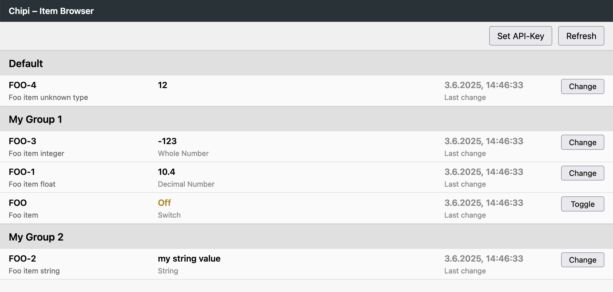

# Chipi Web UI

This is a web interface for the Chipi system to display and control items via a REST API.

## Features

- Display all item groups with its items and their name, label, value, type hint, and timestamp
- Value modification (including toggle for boolean values)
- API key authentication
- Error handling for missing or insufficient rights
- Responsive UI using Lit und TypeScript

## Screenshot



## Development

### Requirements

- Node.js (recommended: >=18)
- npm

### Starting the development environment

```sh
cd ui-ts
npm install
npm run dev
```

The UI will then be available at [http://localhost:5173](http://localhost:5173).  
The API is proxied to [http://localhost:8765](http://localhost:8765).

> **Tipp – eigener Hostname:**  
> Soll der Dev-Server nicht nur auf `localhost`, sondern auf einem
> beliebigen Interface bzw. Hostnamen lauschen, kann man Vite ad-hoc so
> starten:
>
> ```sh
> npm run dev -- --host 0.0.0.0      # an alle Interfaces binden
> # oder
> npm run dev -- --host mypc.local   # bestimmten Hostnamen verwenden
> ```

### Build for production

```sh
npm run build
```

The built frontend will be located in the `ui-ts/dist` directory.

## API

The REST API is documented in [`chipi-api.yaml`](chipi-api.yaml) (OpenAPI 3.0).

- All requests require a valid API key in the `X-Api-Key` header.
- Rights are controlled via scopes (`read`, `update`).

## Project structure

- `ui-ts/` – source code of the web interface (TypeScript, Lit)
- `src/` – backend source code (Common Lisp)
- `chipi-api.yaml` – OpenAPI specification of the REST API

## License

MIT License
